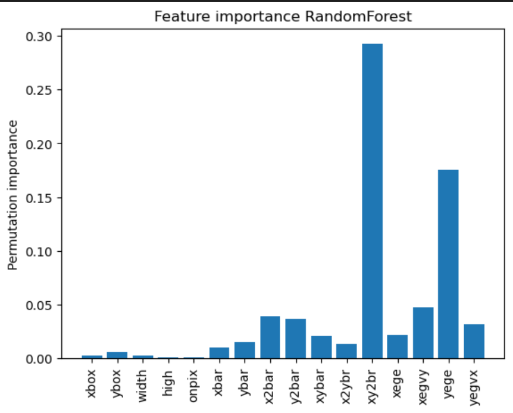

#### Introdution
The purpose of this project is to implement two machine learning algorithms and evaluate them using a real-world dataset. The two algorithms in question are the Decision Tree and Random Forest algorithms.

Later, we will also implement the Permutation Importance algorithm and use it to evaluate the Random Forest algorithm.

### Group Members
-Marius Reikerås
-Lyder Samnøy

### Data Analysis
When implementing the Decision Tree algorithm, our hyperparameters are maximum tree depth, maximum features, and the splitting criterion, where we test entropy and gini.

Our dataset is a collection of letters (written as numbers) with associated measurements of average pixel positions and variance pertaining to each character.

We split the dataset into features (x), and lables (y). The features contain the measurements, whereas the lables represent the actual letter. The core of this assignment is to feed our learning algorithms the features and trian them to accurately predict the correct lables. Tuning each hyperparameter and argument to maximize model accuracy.

For the Decision Tree algorithm. Maximum depth governs how many times the tree can split. if the maximum depth is reached, a leaf node is returned with the most common lable. In the default setup, the maximum depth is none, meaning the tree will grow until the data set is exhausted.

max_features is the number of features to consider when evaluating the best split. We have chosen to set the max_features hyperparameters as the square root of the total number of features, or the log base 2 of the total number of features, as this is recommended in the assignment. Only choosing a small subset of features to consider in each split helps to prevent overfitting. Log2 gives a smaller quantity of features in bigger datasets, but little difference in smaller ones. When max_features is set to none, every split is considered, which often leads to very simmilar trees that split at around the same dominant feature. To create a robust set of Decision Trees for use in the Random Forest, it is important to only consider a small subset of features each time, so the trees are different enough for ensemble learning to be possible.

Entropy and gini are both impurity measures that determine where it is most optimal to splt for maximum information gain (split criterion). We will evaluate which method is more optimal, choosing the criterion argument that yields a higher accuracy.

For the Random Forest algorithm, our hyperparameters are n_estimators, max_depth, the criterion, and max_features.

n_estimators are the number of decision trees in the forest
maximum depth, maximum features, and the criterion argument are the same parameters as with the Decision Tree

### Data Processing
The dataset test/train ratio is 80/20, which is the standard. We also use k-fold cross validation and a random seed.

#### Model Selection and Evaluation 
Preformance tests for the algorithms were mainly done through grid search to find the hyperparameter values which yiled the highest accuracy. For the Decision Tree algorithm, we tested entropy and gini as our criterion arguments. For max_depth, we tested the default value of none, as well as the values 5, 10, 15, and 20. max_features was tested with the values none, sqrt, and log2.

For the Random Forest, we tested with n_estimators set to 10, 20, 30, and 40. For max_features, we reduced the breadth of the tests, only testing sqrt and log2.

For our model selection method, we chose k-fold cross-validation, as decision trees are prone to overfitting, which this method helps to combat. We used k=5 for our cross-validation.

## Decision Trees
We found through our grid search that the most accurate hyperparameter values were to use gini as our criterion argument, max_depth = None, and max_features = log2. with this set of hyperparameters, we arrived at an accuracy score of 0.8681. On the full test set, the final accuracy score was 0.88.

We reasoned however, that this was not an optimal set of parameters for a decision tree, as only choosing the parameters that yield the highest accuracy leads to preformance loss and overfitting.

When comparing the training data and the test data, we found that accuracy scores diverge with max_depth between 5 and 10. We therefore conclude that max_depth = 7 is optimal for our model, and that anything above that likely leads to overfitting (not realizing that overfitting in this case is more optimal). 

With these changes, and using the full training set with CV, accuracy decreases to 0.8300. Prompting further investigation.

## Random Forest 
For the Random Forest, n_estimators = 40, max_depth = 15, criterion = gini, and max_features = log2 yielded an accuracy score of 0.9688, increasing to 0.98 on the full training set when evaluated on the test set. Again, we tweaked the parameters to achieve a less overfitted model. Following the exaple in our Decision Tree, and after analyzing the results graphically, we set n_estimators = 30, max_depth = 7, rest remained unchanged. On the full training data with CV, this reduces the accuracy score to 0.9375.

## Comparing DT and RF
When developing our Decision Tree algorithm, we found that the trees with high accuracy scores were deep and overfitted. When limiting the maximum features, this lead to many vastly different trees that highlighted the discrepencies in the letters. 

Random Forest introduces a significant increase in runtime, while also improving the accuracy significantly. An increase from 0.88(dt) to 0.98(rf) represents a decrease of expected incorrect lables from ca. 1/8, to a much improved 1/50.

## Comparing vs existing implementaions 
When testing the SKlearn algorithms with the same hyperparameters, we arrived at very simmilar accuracy scores:

Our Decision Tree: 0.88
Our Random Forest: 0.98

Sklearn DecisionTree test accuracy: 0.8975
Sklearn RandomForest test accuracy: 0.9875

### Feature importance

Permutation importance is used to check how much each feature actually matters for the model. You shuffle one feature at a time and see how the accuracy changes. A big drop means the feature is important, while little or no change means it isn’t very useful.

In our results, shown in the graph above, almost all features have little or no impact on the model. The three exceptions are **xy2br**, **y2bar** and **yege**, which are both way more impactful on the models performance.

A strength of this method is that it is model agnostic, so it works with any kind of model. It is also easy to understand and explain. However, it has some weaknesses. If features are strongly correlated, the method can underestimate their importance, since shuffling one feature may not matter if another correlated one is still present. It also depends on the test data and can be slow on larger datasets because the model has to be run many times.

#### Conclusion 
When we started this assignment, our hypothesis was that any overfitting in either the Decision Tree or the Random Forest would decrease our test accuracy. However, when running the tests and tuning the hyperparameters, we found that a maximalist(overfitted) decision tree picked by the grid search gave a higher test accuracy than our curated "non-overfitted" hyperparameters. Our conclusion is therefore that the Random forest's ensemble nature turns overfitting from a downside to an upside. When the Decision trees are allowed to grow deep, they follow the biggest outlier of each subset of features they have access to, leading to a collection of very different and noisy trees. These differences are then averaged out by the Random Forest, increasing the robustness, and therefore, the accuracy of the model. 

With our curated hyperparameters, the Decission Trees were not deep enough for the Random Forest to gain all necessary information about the noise and outliers in the data, meaning it would fail more often.